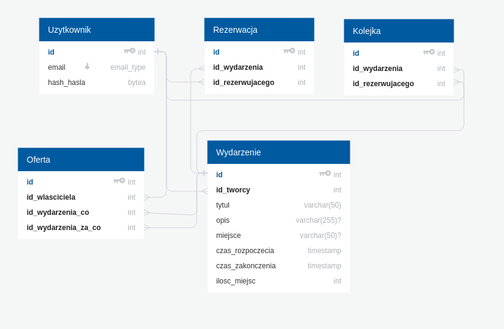

=========================================
System rezerwacji wydarzeń
=========================================

I. Projekt koncepcji, założenia
===============================

Temat projektu:
-----------------

Celem projektu jest stworzenie łatwego w obsłudze systemu, który
umożliwi rezerwację wydarzeń oraz wymianę rezerwacji między użytkownikami.

Przykładowym zastosowaniem może być rezerwacja miejsc na koncert lub
rezerwacja przedmiotów przez studentów.

Analiza wymagań użytkowników:
-----------------------------

- Rejestracja i logowanie użytkowników
- Zmiana hasła użytkownika
- Tworzenie, modyfikacja, usuwanie wydarzeń
- Znajdowanie wydarzeń
- Rezerwowanie, dołączenie do kolejki w razie braku miejsca,
  odrezerwowanie wydarzenia
- Usunięcie rezerwacji przez właściciela wydarzenia
- Dodanie oferty zamiany rezerwacji na inne wydarzenie
- Wyświetlanie wydarzenień, rezerwacji, miejsc w kolejce i ofert
- Wymiana zarezerowanego miejsca z kimś innym

Funkcje jakie ma spełnić baza:
------------------------------

- przechowywać dane
- zachować relacji między danymi
- odwzorowywać stan rzeczywisty, uniemożliwić wprowadzenie niepoprawnych danych
- zapewnić transakcyjność
- zapewnić funkcje/widoki by ułatwić dostęp do danych i zminimaliwować
  ilość przesyłanych danych do aplikacji klienckiej

II. Projekt diagramów
======================

Entity-Relationship Diagram :
--------------------------------------------------

III. Projekt logiczny
=====================

Projektowanie tabel, kluczy, indeksów:
--------------------------------------------------

Do każdej z encji zostało dodane pole `id` które jednoznacznie określa
rekord danej tabeli. Każde z nich jest inicjalizowane sekwencją.

- ``Uzytkownik``

    `Uzytkownik.email` - unikalny email, który będzie wykorzystany
    do logowania i indentyfikacji użytkownika. Jego wartość będzie zawsze
    zapisywana małymi literami, aby zaznaczyć niewrażliwość na wielkość liter.

    `Uzytkownik.hash_hasla` - zaszyfrowane hasło użytkownika.

- ``Wydarzenie``

    `Wydarzenie.id_tworcy` - identyfikuje uzytkownika, który utworzył
    to wydarzenie

    `Wydarzenie.tytul` - tytuł wydarzenia

    `Wydarzenie.opis` - opis wydarzenia, może być pusty

    `Wydarzenie.miejsce` - miejsce gdzie odbędzie się wydarzenie,
    może być puste

    `Wydarzenie.czas_rozpoczecia` - czas rozpoczęcia wydarzenia,
    nie można utworzyć wydarzenia które rozpoczyna się w przeszłości

    `Wydarzenie.czas_zakonczenia` - czas zakończenia wydarzenia

    `Wydarzenie.ilosc_miejsc` - ilość wolnych miejsc, po zajęciu wolnych miejsc
    osoby będą zapisywane do kolejki

    .. note::
        `id_tworcy` i `tytul` są unikalne - użytkownik może tworzyć
        tylko jedno wydarzenie o tym samym tytule

- ``Rezerwacja``

    `Rezerwacja.id_wydarzenia` - wydarzenie którego dotyczy rezerwacja

    `Rezerwacja.id_rezerwujacego` - uzytkownik, który dokonał rezerwacji

    .. note::
        `id_wydarzenia` i `id_rezerwujacego` są unikalne dla tej tabeli.

- ``Kolejka``

    `Kolejka.id_wydarzenia` - wydarzenie którego dotyczy rezerwacja

    `Kolejka.id_rezerwujacego` - uzytkownik, który dokonał rezerwacji

    .. note::
        `id_wydarzenia` i `id_rezerwujacego` są unikalne dla tej tabeli.

- ``Oferta``

    `Oferta.id_wlasciciela` - użytkownik, który chce się wymienić

    `Oferta.id_wydarzenia_co` - wydarzenie do którego właściciel posiada
    rezerwację i chce wymienić na inne

    `Oferta.id_wydarzenia_za_co` - wydarzenie do którego właściciel nie posiada
    rezerwacji i chce je uzyskać

    .. note::
        `id_wlasciciela`, `id_wydarzenia_co`, `id_wydarzenia_za_co` są unikalne
        dla tej tabeli, ponieważ użytkownik nie może wystawiać identycznych
        ofert.

Skrypt tworzący tabele bazy danych znajduje się w
``sql_scripts/create_tables.sql``.

Widoki:
-------

- `lista_ofert` - przedstawia listę ofert wymiany wraz ze szczegółami

Dziedziny:
----------

- `email_type` - dziedzina typu varchar reprezentująca email, sprawdza czy
  email jest zgodny ze wzorcem zdefionowanym w standardach RFC 5322 i RFC 5321.

Analiza zależności funkcyjnych i normalizacja tabel:
----------------------------------------------------

Przechowywane dane są zorganizowane w tabele opisujące jeden typ obiektów,
wartości atrybutów są atomowe. Informacje zawarte w bazie nie są redundantne.
Żaden atrybut nie należący do klucza nie jest zależny funkcyjnie od innych
atrybutów niekluczowych. Wynika z tego, że baza została znormalizowana do
postaci 3NF.

Zaprojektowane operacje na danych:
----------------------------------

Triggery oraz funkcje są zdefiniowane w pliku
`sql_scripts/create_functions.sql`.

Funkcje tworzące triggery:
++++++++++++++++++++++++++

- `lower_email_field()`
- `uzupelnij_z_kolejki()`
- `uzupelnij_z_kolejki_po_zwiekszeniu_liczby_miejsc()`
- `usun_oferty()`

Funkcje logiczne:
+++++++++++++++++

- `usun_wydarzenie(m_id_uzytkownika integer, m_id_wydarzenia integer)`
- `zarezerwuj(m_id_rezerwujacego integer, m_id_wydarzenia integer)`
- `wymien(m_id_akceptujacego integer, m_id_oferty integer)`
- `usun_rezerwacje(m_uid integer, m_id_rezerwacji integer)`
- `usun_z_kolejki(m_uid integer, m_id_rezerwacji integer)`
- `dodaj_oferte(m_id_tworcy integer, m_id_wydarzenia_co integer,`
  `m_id_wydarzenia_za_co integer)`
- `usun_oferte(m_id_uzytkownika integer, m_id_oferty integer)`

Funkcje do pobierania danych:
+++++++++++++++++++++++++++++

- `licz_ilosc_chetnych(m_id_wydarzenia integer)`
- `licz_ilosc_zajetych_miejsc(m_id_wydarzenia integer)`
- `licz_ilosc_wolnych_miejsc(m_id_wydarzenia integer)`
- `pokaz_szczegoly_wydarzenia(id_wyd integer)`
- `pokaz_rezerwacje_wydarzenia(m_id_uzytkownika integer,`
  `m_id_wydarzenia integer)`
- `pokaz_kolejke_wydarzenia(m_id_uzytkownika integer, m_id_wydarzenia integer)`
- `pokaz_rezerwacje_uzytkownika(id_uzytkownika integer)`
- `pokaz_kolejke_uzytkownika(id_uzytkownika integer)`
- `znajdz_wydarzenia(m_tytul text, m_email_wlasciciela text)`

IV. Projekt funkcjonalny
========================

Strona składa się z następujących podstron:

- Strona początkowa - znajduje się tu formularz za pomocą którego
  użytkownik jest w stanie się zalogować.

- Rejestracja - zawiera formularz, który pozwala na dodanie użytkownika
  do bazy.

- Rezerwacje - jest to strona główna po zalogowaniu. Umieszczone tu są - lista
  rezerwacji bieżącego użytkownika oraz lista miejsc w kolejce. Listy te
  przedstawiają najbardziej przydatne informacje na temat rezerwowanych
  wydarzeń oraz umożliwiają przejście do szczegółów wydarzenia lub
  ich usunięcie.

- Wydarzenia -> Stwórz nowe wydarzenie - umożliwia dodanie nowego wydarzenia

- Wydarzenia -> Moje wydarzenia - pokazuje listę wydarzeń (wraz z przydatnymi
  szczegółami i opcjami) utworzonych przez zalogowanego użytkownika.

- Wydarzenia -> Wyszukaj wydarzenia - domyślnie wyświetla wszystkie dostepne
  wydarzenia (wraz z przydatnymi szczegółami i opcjami), które jeszcze się
  nie zakończyły oraz udostępnia formularz filtrujący.

- Oferty wymian -> Moje oferty - wyświetla listę ofert (wraz z przydatnymi
  szczegółami i opcjami), których właścicielem jest zalogowany użytkownik.

- Oferty wymian -> Dostępne oferty - domyślnie wyświetla wszystkie dostepne
  oferty wymian (wraz z przydatnymi szczegółami i opcjami). Oferty dotyczą
  wydarzeń, które jeszcze się nie zakończyły.

- Zmiana hasła -> udostępnia formularz zmiany hasła.

V. Dokumentacja
======================

Krótka instrukcja obsługi:
--------------------------

Projekt jest zrealizowany w formie strony internetowej. Nawigacja jest
możliwa dzięki menu głównemu umieszczonemu na górze strony.

Użytkowników aplikacji można podzielić na dwie role właściciel wydarzenia
i uczestnik wydarzenia. Przy czym każdy użytkownik może pełnić obie
z tych ról.

Utworzone wydarzenia są widoczne przez wszystkich użytkowników.
Użytkownik inny niż właściciel może sobie zarezerwować miejsce na wydarzeniu.
W przypadku gdy wszystkie miejsca są już zajęte użytkownik trafi na koniec
kolejki. A gdy tylko pojawi się wolne miejsce pierwsza osoba z kolejki
dostanie rezerwację.

Właściciel wydarzenia ma nad nim całkowitą kontrolę, może on edytować jego
właściwości, usuwać rezerwacje użytkowników oraz ich miejsca w kolejce.

Użytkownicy mogą również wymieniać się swoimi rezerwacjami między sobą.
Aby to zrobić należy przejść do szczegółów wydarzenia i dodać ofertę zamiany.
Następnie spełniająca wymagane warunki osoba może potwierdzić wymianę,
co spowoduje zamianę rezerwacji.

Właściciel widzi emaile wszystkich uczestników i osób w kolejce,
co jest niewidoczne dla innych.

Techniczny opis aplikacji:
--------------------------

Aplikacja została napisana w języku `Python 3 <https://www.python.org/>`_
przy wykorzystaniu mikroframeworka `Flask <http://flask.pocoo.org/docs/1.0/>`_.
Połączenie z bazą odbywania się przy użyciu adaptera do PostgreSQL o nazwie
`Psycopg2 <http://initd.org/psycopg/docs/>`_.

Aplikacja została podzielona na paczki oraz foldery:

- ``docs`` - folder z dokumentacją Sphinx
- ``config`` - zawiera ona podstawową konfigurację bazy danych oraz
  wyrażenia stałe
- ``forms`` - tu zdefiniowane są formularze wykorzystywane przez aplikację
- ``storage`` - tu zdefinowana jest klasa odpowiedzialna za komunikację
  z bazą danych
- ``templates`` - folder z szablonami Jinja2 (html)
- ``utils`` - paczka z funkcjami pomocnicznymi
- ``views`` - jest to kontroler aplikacji

Wykaz literatury:
--------------------

- https://www.postgresql.org/docs/
- http://flask.pocoo.org/docs
- http://initd.org/psycopg/docs/

.. .. toctree::
..    :maxdepth: 2
..    :caption: Contents:

.. * :ref:`genindex`
.. * :ref:`modindex`
.. * :ref:`search`

